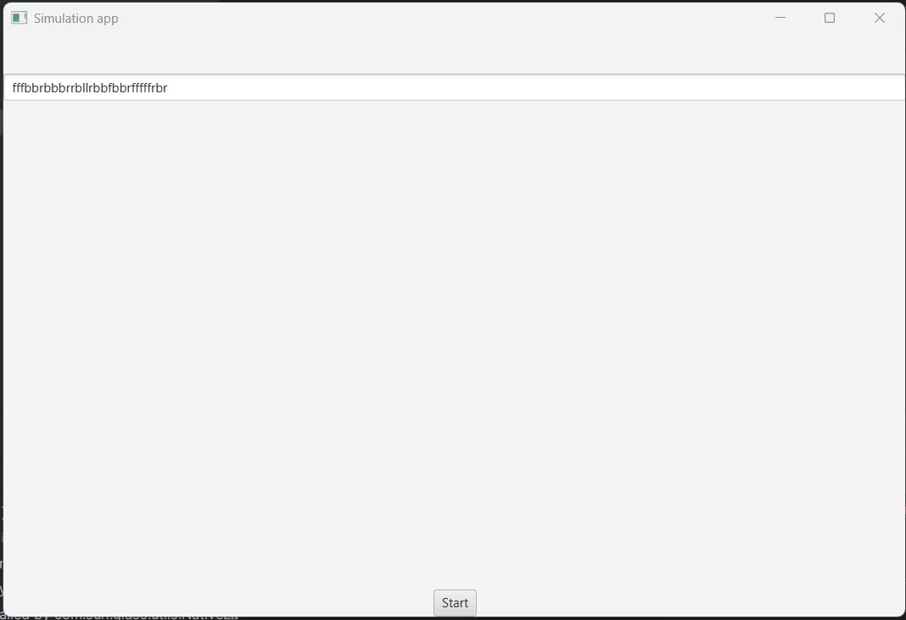
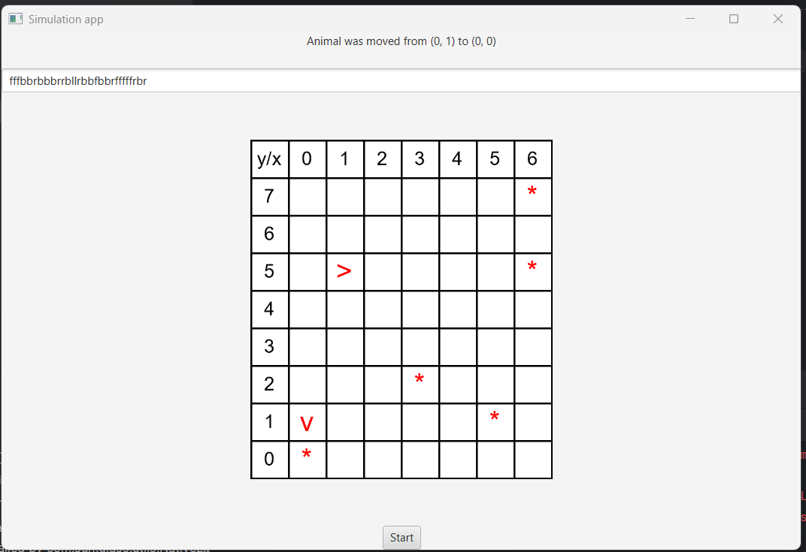
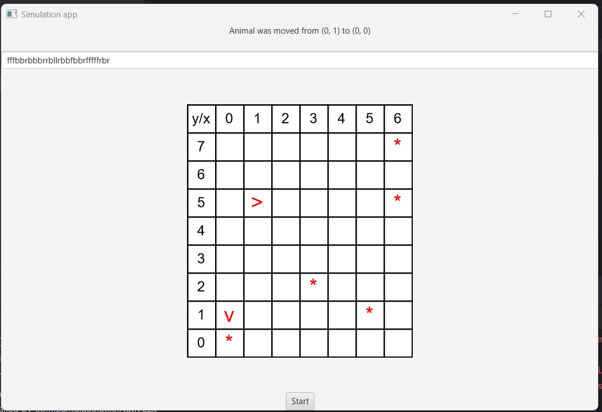

# OOP – Animal World Simulation

A Java simulation of a 2D world with animals and grass moving around a grid. Built as coursework for the **Object-Oriented Programming** course during my master's studies at **AGH University**, Kraków, following the assignments from the course repository [Soamid/obiektowe-lab](https://github.com/Soamid/obiektowe-lab).

## What it is

Animals move and turn on a map based on simple move commands (`f`/`b`/`l`/`r`). The map validates moves, notifies observers of changes (observer pattern), and can be viewed either as ASCII art in the console or in a JavaFX window. The project demonstrates core OOP concepts: interfaces, abstract classes, inheritance, encapsulation, custom exceptions and multithreading.








## Tech stack

- Java 25, built with Gradle (Gradle Wrapper included)
- JavaFX 21 for the GUI
- JUnit 5 for unit tests

## How to run

```bash
git clone https://github.com/hylaj/PO_2025_PT1130_HYLA.git
cd PO_2025_PT1130_HYLA/oolab
 
./gradlew test   # run unit tests
./gradlew run    # run the console version (agh.ics.oop.World)
```

For the JavaFX GUI, open the \`oolab\` folder in IntelliJ IDEA and run \`WorldGUI.java\` directly.

## Course context

This repo covers the successive labs building up the same codebase: control flow, the object model, object interactions, interfaces and maps, inheritance, refactoring, multithreading, and the JavaFX GUI. Full instructions: [Soamid/obiektowe-lab](https://github.com/Soamid/obiektowe-lab).
